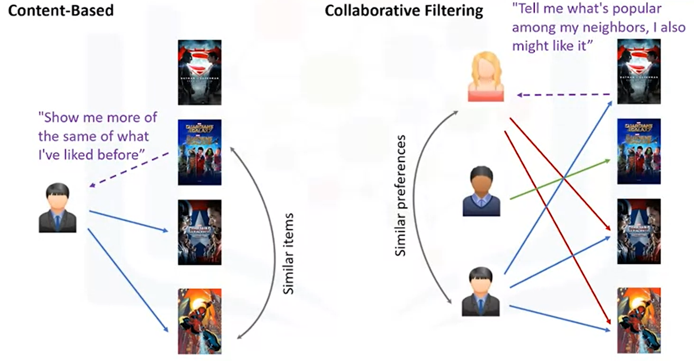
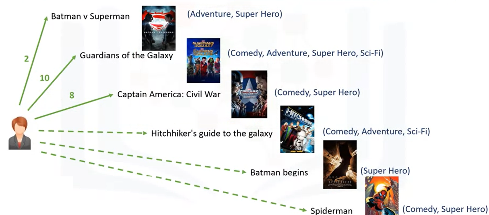
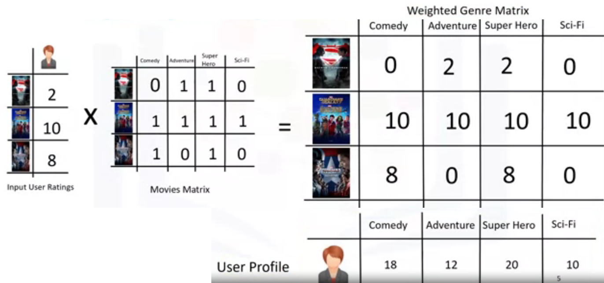
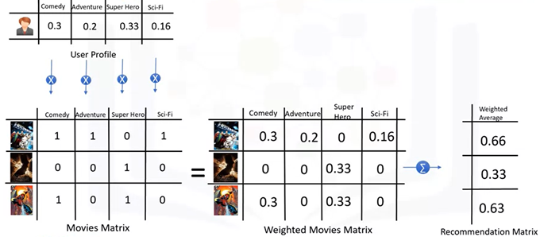
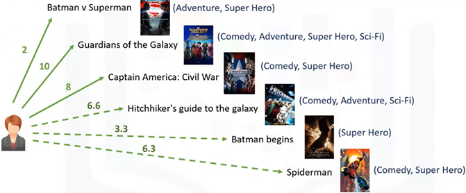

# Recommender Systems

## Definition
Recommender systems capture the patterns of peoples' behaviour and use to predict what else they might want or like. One of the main advantages of using recommendation systems is that users get a broader exposure to many different products they might be interested in. This exposure encourages users towards continual usage or purchase of their product. Not only does this provide a better experience for the user but it benefits the service provider, as well, with increased potential revenue and better security for its customers. 

## Types of Recommender Systems / Recommendation Engines
There are generally 2 main types of recommendation systems: 
1. Content-based 
2. Collaborative filtering

Also, there are hybrid recommender systems, which combine various mechanisms. In terms of implementing recommender systems, there are 2 types:
1. Memory-based 
2. Model-based

In memory-based approaches, we use the entire user-item dataset to generate a recommendation system. It uses statistical techniques to approximate users or items. Examples of these techniques include: Pearson Correlation, Cosine Similarity and Euclidean Distance, among others. In model-based approaches, a model of users is developed in an attempt to learn their preferences. Models can be created using Machine Learning techniques like regression, clustering, classification, and so on. 

### Content-based
The main paradigm of a Content-based recommendation system is driven by the statement: “Show me more of the same of what I've liked before." Content-based systems try to figure out what a user's favorite aspects of an item are, and then make recommendations on items that share those aspects. 

A content-based recommendation system tries to recommend items to users based on their profile. The user's profile revolves around that user's preferences and tastes. It is shaped based on user ratings, including the number of times that user has clicked on different items or perhaps even liked those items. The recommendation process is based on the similarity between those items. Similarity or closeness of items is measured based on the similarity in the content of those items. 

For example, we have 4 movies, and the user likes or rates the first 2. If the 3rd is similar to movie 1 (e.g. in terms of their genre), the engine may also recommend movie 3 to the user. 

#### Worked Example

##### Background and assumptions

- Assume we have a data set of only 6 movies. 
- This data set shows 3 movies that our user has watched and rated out of 10, 3 that the user has not watched (and therefore do not have a user rating yet), and also the genre of each of the movies. 
- For example, Batman versus Superman is in the Adventure, Super Hero genre and Guardians of the Galaxy is in the Comedy, Adventure, Super Hero and Science-fiction genres. 
- The user has given a rating of 2/10 to the first movie, 10/10 to the second movie, 8/10 to the third.
- The task of the recommender engine is to recommend one of the three candidate movies to this user, or in other words we want to predict what the user's possible rating would be of the three candidate movies if she were to watch them. To achieve this, we have to build the user profile.

##### Weighing the genres

- First, we create an 'Input User Ratings' matrix to show the user's ratings for the movies that they have already watched. 
- Then, we encode the movies through the one-hot encoding approach. Genre of movies are used here as a feature set. We use the first three movies to make this matrix, which represents the movie feature set matrix. 
- Multiplying these two matrices gives the weighted feature set for the movies, or the 'Weighted Genre matrix', which represents the interests of the user for each genre based on the movies that they have watched. 
- Now, given the Weighted Genre Matrix, the profile of the active user can be shaped. Essentially, the weighted genres can be aggregated and then normalised (shown in the next step) to find the user profile. 
- Here, it clearly indicates that the user likes superhero movies more than other genres. This profile is used to figure out what movie is proper to recommend to this user.

##### Using the user profile to create recommendations

- To recommend (or not recommend) movies that haven't been watched by the user, these movies must be encoded as well. 
- Multiply the User Profile matrix by the candidate Movie Matrix, which results in the Weighted Movies Matrix. It shows the weight of each genre with respect to the User Profile. 
- Now, aggregating these weighted ratings gives the active user's possible interest level in these three movies. In essence, it's the recommendation lists, which can be sorted to rank the movies and recommend them to the user. For example, we can say that the Hitchhiker's Guide to the Galaxy has the highest score in our list, and it's proper to recommend to the user. 

##### Final recommendations
The result of this matrix multiplication is the following ratmings for the unwatched movies:

##### Advantages and disadvantages of content-based recommendations
The recommendation in a content-based system is based on user's taste and the content or feature set items. Such a model is very efficient, but in some cases, it doesn't work. For example, assume that that there is a a movie in the drama genre, which the user has never watch. This genre would not be in the user profile, and the recommender engine may never recommend any movie within other genres. This problem can be solved by other types of recommender systems such as collaborative filtering.

### Collaborative Filtering
Collaborative filtering is based on a user saying, “Tell me what's popular among my neighbors because I might like it too.” Collaborative filtering techniques find similar groups of users, and provide recommendations based on similar tastes within that group. In short, it assumes that a user might be interested in what similar users are interested in. 

## Use Cases
Recommender systems are probably the set of algorithms that are most commonly interacted with in modern life, with sites from Amazon to Netflix using some form of recommendation system/engine to suggest items to buy, films to watch, and to provide a better experience on the web.

Netflix is driven by customer selection, whereby if a certain movie gets viewed frequently enough, the recommender system ensures that that movie gets an increasing number of recommendations.

On social media, sites like Facebook or LinkedIn regularly recommend friendships and connections. Recommender systems are even used to personalize your experience on the web. For example, when you go to a news platform website, a recommender system will make note of the types of stories that you clicked on and make recommendations on which types of stories you might be interested in reading in future. 

